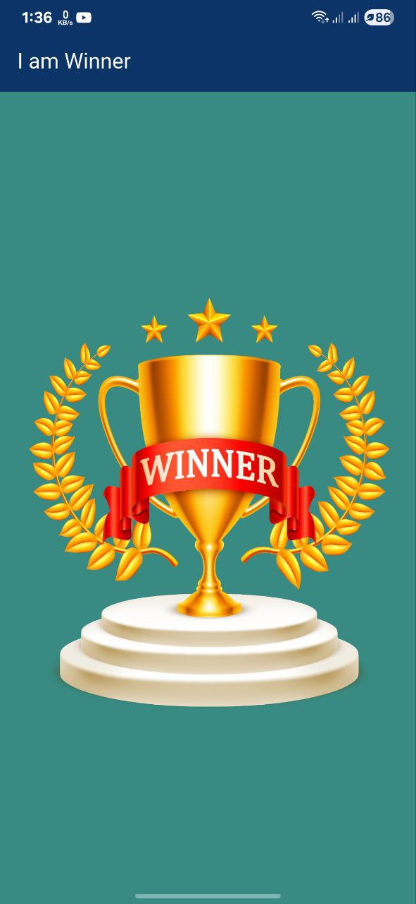

# I Am Winner App

## Overview

I Am Winner is a simple mobile app built with Flutter, inspired by the discontinued 2008 app "I Am Rich." This app serves as a beginner-friendly project to learn and experiment with Flutter features. It has minimal functionality: upon opening, it only displays a glowing golden trophy on the screen, symbolizing victory and success. No additional elements like mantras are included, keeping it straightforward for learning purposes.

The app is designed as a joke or novelty item but primarily as a hands-on way to try Flutter's UI building, animations, and asset integration. It pokes fun at premium app pricing while providing a basic template for Flutter development.

Developed by [Your Name or Handle].

## Features

*   **Minimalist Design**: Displays only a glowing golden trophy with optional animations (e.g., glow effect) to practice Flutter widgets and effects.
*   **Cross-Platform**: Works on both iOS and Android using Flutter.
*   **Learning Focus**: Ideal for experimenting with Flutter features like `CustomPaint`, animations, or asset loading.
*   **No Ads or In-App Purchases**: Pure simplicity for educational purposes.

## Installation

This is a Flutter project. To get started:

1.  Ensure you have Flutter installed (see [Flutter docs](https://docs.flutter.dev/get-started/install)).
2.  Clone the repository:
    ```bash
    git clone https://github.com/yourusername/i-am-winner.git
    ```
3.  Navigate to the project directory:
    ```bash
    cd i-am-winner
    ```
4.  Install dependencies:
    ```bash
    flutter pub get
    ```
5.  Run the app (on a connected device or emulator):
    ```bash
    flutter run
    ```

*(Note: For app store submission, add more features as minimal apps may not meet guidelines. This is primarily for learning and local testing.)*

## App Icon

The app icon should represent winning and luxury. Use the following AI prompt to generate it:

> "Generate a high-resolution square app icon (1024x1024 pixels) for a mobile app called 'I Am Winner'. The design should feature a central glowing golden trophy with rays of light emanating from it, symbolizing victory, success, and luxury. Incorporate shiny metallic effects, vibrant gold and yellow tones, and a subtle background gradient for depth. Make it elegant, eye-catching, and premium-feeling, similar to the 'I Am Rich' app's glowing red gem. Ensure it's simple yet opulent, optimized for app store display."

You can paste this prompt into an AI image generator like Midjourney, DALL-E, or Stable Diffusion to create the icon. Once generated, add it to the `assets` folder and update `pubspec.yaml` for Flutter integration.

## Screenshots

(Add screenshots here once generated, e.g., via placeholders:)




## Contributing

Feel free to fork and improve! Pull requests are welcome for adding Flutter features like animations, themes, or state management examples to enhance the learning experience.

## License

This project is licensed under the MIT License - see the `LICENSE` file for details.

## Acknowledgments

*   Inspired by Armin Heinrich's "I Am Rich" app.
*   Thanks to Flutter community resources and AI tools for icon generation ideas.
